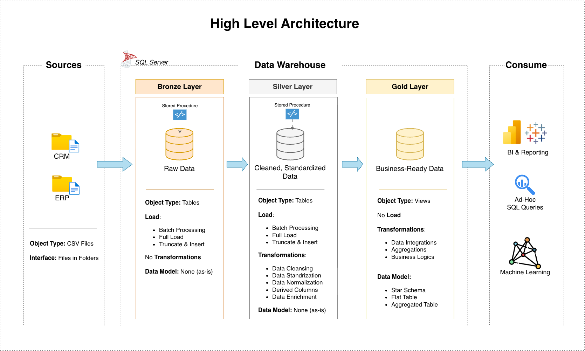

# Construindo um Data Warehouse (Data Engineering)

## Visão Geral

Este repositório apresenta a implementação de um **Data Warehouse** analítico com foco na aplicação prática de conceitos de **engenharia de dados, arquitetura de dados, ETL e modelagem dimensional**.

O projeto simula um cenário real de consolidação de dados provenientes de múltiplos sistemas transacionais, organizando-os em uma arquitetura estruturada e preparada para análises analíticas e geração de indicadores de negócio.

## Requisitos do Projeto

### Objetivo
Desenvolver um data warehouse moderno usando o SQL Server para consolidar dados de vendas, permitindo a geração de relatórios analíticos e a tomada de decisões informadas.

### Especificações
- **Fontes de Dados**: Importar dados de dois sistemas de origem (ERP e CRM) fornecidos como arquivos CSV.
- **Qualidade de Dados**: Corrigir e resolver problemas de qualidade de dados antes da análise.
- **Integração**: Combinar ambas as fontes em um único modelo de dados fácil de usar, projetado para consultas analíticas.
- **Escopo**: Focar apenas no conjunto de dados mais recente; a historização dos dados não é necessária.
- **Documentação**: Fornecer documentação clara do modelo de dados para dar suporte tanto às partes interessadas do negócio quanto às equipes de análise.

Para obter mais detalhes, consultar [docs/requirements.md](docs/requirements.md).

## Arquitetura de Dados

Para garantir organização e evolução controlada dos dados, a arquitetura adotada segue o padrão **Medallion Architecture**, dividida em três camadas:  **Bronze**, **Silver** e **Gold**.



1. **Camada Bronze** — Dados Brutos
   - Armazena os dados exatamente como recebidos da origem
   - Ingestão de arquivos CSV provenientes de sistemas ERP e CRM
   - Não há transformações nesta camada
   - Serve como zona de rastreabilidade e auditoria dos dados

3. **Camada Silver** — Dados Tratados
   - Limpeza e padronização dos dados
   - Tratamento de problemas de qualidade (nulos, formatos inválidos, inconsistências)
   - Normalização e conformidade entre fontes distintas
   - Preparação dos dados para uso analítico

5. **Camada Gold** — Dados Prontos para Negócio
   - Dados modelados com foco em consumo analítico
   - Implementação de **modelagem dimensional** (Star Schema)
   - Criação de tabelas fato e dimensões
   - Base para indicadores, métricas e análises de negócio

## ETL & Engenharia de Dados

O projeto implementa pipelines de ETL utilizando SQL, estruturados por camadas, com foco em:
* Extração de dados de múltiplas fontes (ERP e CRM)
* Transformações progressivas e controladas
* Carga dos dados em modelos analíticos
* Manutenção da integridade, consistência e desempenho das consultas

Essa separação por camadas torna o processo mais modular, reutilizável e fácil de manter.

## Modelagem de Dados

A modelagem da camada Gold segue princípios clássicos de modelagem dimensional, incluindo:
* Definição clara da granularidade das tabelas fato
* Uso de tabelas dimensão para contexto analítico
* Chaves substitutas (surrogate keys)
* Estruturas pensadas para workloads analíticos

Os modelos são documentados visualmente com diagramas desenvolvidos no Draw.io.

## Análises e Consumo de Dados

Com os dados consolidados na camada Gold, o projeto viabiliza análises baseadas em SQL, com foco em:
* Análise de comportamento de clientes
* Avaliação de desempenho de produtos
* Identificação de tendências e métricas de vendas

O objetivo é demonstrar como uma arquitetura bem definida simplifica o consumo analítico e melhora a confiabilidade das análises.

## Tecnologias e Ferramentas

As seguintes ferramentas foram utilizadas no desenvolvimento do projeto:
* SQL Server Express — Banco de dados do Data Warehouse
* SQL Server Management Studio (SSMS) — Desenvolvimento e execução de scripts
* Git e GitHub — Controle de versão e versionamento do projeto
* Draw.io — Diagramas de arquitetura, fluxo de dados e modelagem
* Notion — Planejamento do projeto e organização das tarefas

## Estrutura do Repositório

```
sql-data-warehouse-project/
│
├── datasets/                        # Arquivos CSV de origem (ERP e CRM)
│
├── docs/                            # Documentação e diagramas do projeto
│   ├── data_architecture.drawio     # Arquivo Draw.io com a arquitetura do projeto
│   ├── data_flow.drawio             # Arquivo Draw.io com o diagrama de fluxo de dados
│   ├── data_models.drawio           # Arquivo Draw.io com o modelos de dados (Star Schema)
│   ├── data_catalog.md              # Catálogo de conjuntos de dados, incluindo descrições de campos e metadados
│   ├── naming-conventions.md        # Diretrizes para nomenclatura de tabelas, colunas e arquivos
│
├── scripts/                         # Scripts SQL para ETL e transformações
│   ├── bronze/                      # Scripts de ingestão de dados brutos
│   ├── silver/                      # Scripts de limpeza e transformação dos dados
│   ├── gold/                        # Scripts de modelagem analítica
│
├── tests/                           # Testes e validações de qualidade de dados
│
├── README.md                        
├── LICENSE                          
├── .gitignore                       
└── requirements.txt                 # Dependências e requisitos do projeto
```

---

## Referências e Créditos

Este projeto foi desenvolvido como projeto de portfólio, inspirado na série de projetos de Data Engineering do [Baraa Khatib Salkini](https://www.linkedin.com/in/baraa-khatib-salkini/) (Data With Baraa).

A implementação, organização do repositório e documentação foram adaptadas e executadas de forma independente, com foco em aprendizado prático e aplicação de boas práticas do mercado.

## 🛡️ Licença

Este projeto está licenciado sob a [MIT License](LICENSE). Você é livre para usar, modificar e compartilhar, desde que mantenha os devidos créditos.
